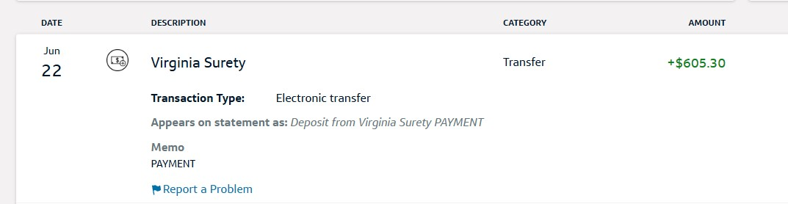
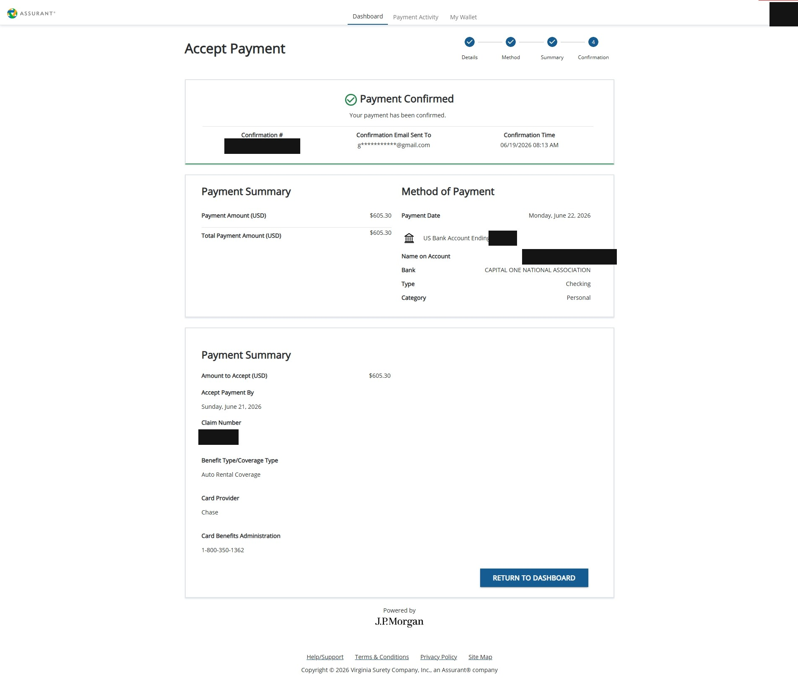
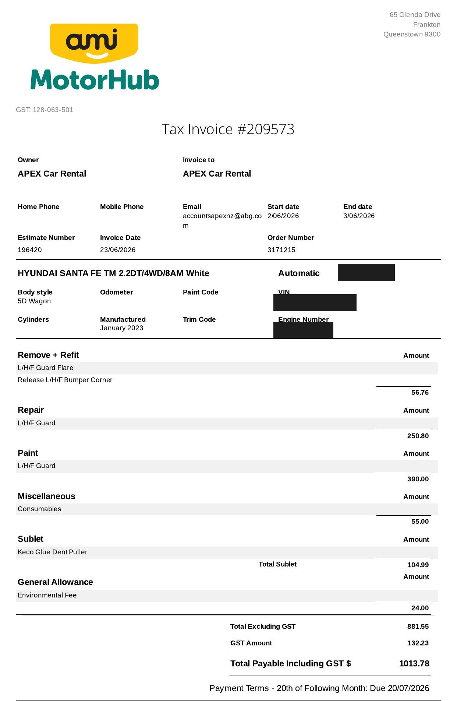

# 信用卡附的租車險真的賠嗎？Chase CSP 紐西蘭租車實戰：被圈走 NZD 1,000，全額拿回

先講結果：在紐西蘭租車被刮了一道，還車時被租車公司從信用卡圈走 NZD 1,000。我靠 Chase Sapphire Preferred 附帶的免費租車險，把錢全額拿了回來——**USD 605.30，ACH 直接入帳**。

_錢真的進帳戶了：Virginia Surety（Chase 租車險承保公司）匯入 USD 605.30，電子轉帳，帳單顯示「Deposit from Virginia Surety PAYMENT」。_

很多人辦了 CSP，知道它「有租車險」，但從來沒真的用過，心裡多少有個問號：**出事了，真的賠嗎？**

賠。而且 Chase 端的效率好得出乎意料。整趟理賠真正的敵人不是保險公司，是拖延的租車公司。這篇把完整流程寫下來，讓下一個出事的人照著走就好。

---

## 時間線：事故到拿錢 126 天

| 時間 | 事件 |
|------|------|
| 2/4 | Queenstown 取車（Hyundai Santa Fe），**拒保 CDW** |
| 2/16 | Oamaru 路邊停車，回來發現左前輪拱被刮（無目擊、原因不明）|
| 2/17 | Christchurch 還車，當場填事故報告；被圈走 **NZD 1,000**（合約 excess 上限）|
| 4/14 | 開始向租車公司索取維修文件（拖延從這裡開始）|
| 4/16 | chasecardbenefits.com 開 claim |
| 5/23 | 上傳租車合約＋Chase 帳單 |
| 6/12 | 放棄等最終發票、改要估價單成功；當天文件全數上傳 |
| 6/18 | **Chase 核准，核賠 USD 605.30** |
| 6/22 | **ACH 入帳，結案** |

看出重點了嗎？**事故到拿錢 4 個月，其中將近 2 個月在等租車公司給文件。Chase 從文件齊全到錢入帳，只花了 10 天。**

---

## 用這個福利的三個前提

CSP 的租車險（Auto Rental Coverage）不是自動生效，三個條件缺一不可：

1. **租車費全額刷 CSP**——不能分卡刷、不能用其他方式折抵
2. **取車時拒保租車公司的 CDW**（碰撞損害豁免）
3. **本人是租車合約上的主要駕駛人**

取車櫃台問你要不要保險時，一句話：

> I decline the CDW. My credit card provides primary coverage.

櫃台會多圈存一筆保證金（我這次是 NZD 2,000–3,000 這個等級），正常現象，還車沒事就解圈。

這裡的關鍵字是 **Primary**。CSP 的租車險是主要承保——直接找信用卡理賠，不需要先動用你自己的其他保險。這也是 CSP 在租車這件事上比很多卡強的地方。

---

## 出事當下要做什麼

我的事故很典型：路邊停車，人不在場，回來發現輪拱多了一道刮痕。沒有目擊者，原因不明。

當下三件事：

1. **拍照**——損傷處、車身四周、周圍環境都拍
2. **還車時當場填事故報告**（Vehicle Incident/Loss Report），照實寫：何時發現、車停哪、無目擊
3. **跟櫃台要理賠文件的聯絡窗口**（email），之後催文件全靠它

租車公司會依合約把 excess 上限從你的卡圈走。我被圈 NZD 1,000——先別心痛，這筆就是待會要跟 Chase 拿回來的錢。

（補一句避免誤會：Chase 是美國卡，理賠**折成美金賠付**。我被收 NZD 1,000，Chase 按當時匯率核賠 USD 605.30，不是幣別對不上，是同一筆錢換算過去。）

---

## 開 Claim：chasecardbenefits.com

**期限：損壞日起 100 天內要開案**，文件可以慢慢補（上限 365 天），所以不用等租車公司的文件到齊才動手——**先開案卡位**。

到 chasecardbenefits.com 填事故詳情，幾個填法重點：

- Loss type：Collision / Physical Damage
- 金額：填**實際被圈走的金額**（我填 1,000 NZD）
- Declined CDW：Yes
- Primary renter：Yes
- 付款方式：選 **ACH**（匯任何美國銀行帳戶，不限 Chase）

填完拿到 claim number，狀態會顯示 Open - Pending Documents，等你補文件。

---

## 三份必備文件

| 文件 | 重點 |
|------|------|
| 租車合約 | 含租車人、車輛、租期、費用明細與付款確認 |
| Chase 帳單 | 顯示持卡人、卡號末四碼、租車那筆交易 |
| 維修估價單**或**發票 | 租車公司提供，標明損壞項目與金額 |

一個實戰細節：**紙本合約翻拍照很有價值**。紙本上的「Amount Paid / Amount Due $0.00」和雙方簽名，正好滿足「最終付款確認」的要求，電子版合約不一定有這些。

---

## 關鍵突破：不用等最終發票，估價單就能核賠

這是本案最值得記下來的一課。

租車公司最常見的拖延理由是「還在等修車廠出發票」——我就這樣被拖了三個星期。後來仔細看 Chase 的文件要求，寫的是 **repair estimate *or* invoice**。

估價單就夠了。而且租車公司跟你收費時，手上**必然**已經有估價單（不然金額哪來的）。直接開口要 estimate/quote，僵局立刻解開。我拿到估價單當天上傳，6 天後核准。

---

## 對付拖延的租車公司

兩個月的往返，我學到三招：

1. **講清楚你不是「第三方保險理賠」。** 租車公司常誤以為是旅遊險公司要介入，搬出資料保護法拒絕配合。明確說：這是**信用卡附帶險**，文件寄給我本人，我自己上傳，沒有第三方。
2. **用 Chase 的催件信當施壓點。** Chase 會警告「文件未到，claim 將轉 inactive/closed」——把這句轉述給租車公司，附上明確期限，效果比客氣詢問好得多。
3. **引用對方自己的承諾。**「你 5/22 說車已修好、在等發票」——貼回去，對方很難再打太極。

另外，Chase 的催件信是模板，會把全部文件重新列一遍，**已上傳的也照列**。收到不用慌，核對自己的紀錄確認真正缺哪份就好。

---

## 核准 ≠ 自動入帳：領款還有最後一步

很多人以為核准信到手就等錢入帳——不是。

核准後 1 個工作天內，會收到 **donotreply@jpmorgan.com** 的付款設定信（**記得翻垃圾郵件匣**）。點進去註冊、驗證開案時留的電話、填收款帳戶的 routing + account number——**任何美國銀行都可以，不限 Chase**。

**硬性期限而且很短**——信上會寫 Action Needed By 哪天，我的是 6/19 晚上收信、6/21 截止，實際只有 2 天。逾期改開紙本支票寄到你 file 上的地址，台灣託收美金支票又慢又貴，務必走 ACH。我當晚就完成設定，6/22 錢就進帳戶了。

_付款設定完成頁：Payment Confirmed，金額 USD 605.30，Benefit Type 寫明 Auto Rental Coverage、Card Provider 是 Chase，由 J.P.Morgan 執行撥款。（個資已遮）_

---

## 最後一步：跟租車公司要最終發票核對

錢拿到不代表結束。租車公司是按「估價」圈款的，常見爭議是**估價膨風、實修便宜、差額不退**。

所以理賠入帳後，我還是跟租車公司要了最終發票核對：實際維修費 NZD 1,013.78，對方收我 NZD 1,000——不但沒超收，還少收了 13.78，對方自行吸收結案。

_維修廠開給租車公司的最終發票：鈑金＋烤漆＋耗材逐項列出，含 GST 總額 NZD 1,013.78，比 Apex 圈走的 NZD 1,000 還多——確認沒被超收。（車輛識別碼已遮）_

這一步多數人不會做。但如果核對出來對方多收了，你有發票在手，退差額就有憑有據。

---

先說清楚：這篇是我個人這一次的理賠 DP，不代表每個 case 都是同樣結果。承保細節以你的卡片當期 Guide to Benefits 為準——出發自駕前，值得花十分鐘把那份文件讀一遍。

---

## 台灣讀者三個避坑提示

**1. 租車費全額刷同一張卡，取車時明確拒保 CDW**

Coverage 成立的地基。分卡刷、用點數折抵、或糊里糊塗被櫃台加保 CDW，理賠時都可能出問題。

**2. 事故後立刻開案、立刻催文件，並且早早開口要估價單**

開案 100 天期限比想像中短（尤其扣掉回國、時差、來回信件的時間）。租車公司說「等發票」，你就要 estimate——這是整案最省時間的一句話。

**3. 核准後的領款期限守好（可能只有 2 天）**

jpmorgan 的信可能躺在垃圾郵件匣，而 Action Needed By 的期限很短（我只有 2 天）。錯過就變紙本支票寄台灣，光想就累。

---

## 彩蛋：連被圈走的錢都在幫我賺點數

最後補一個很多人不會想到的地方：被 Apex 圈走的那筆 NZD 1,000，**本身也是一筆刷卡消費**。CSP 對租車類消費給 2x 點數，這筆替我賺了約 1,200 點 Ultimate Rewards。

換句話說，這 NZD 1,000 我不但全額拿回 USD 605.30，過程中還順手賺了點數。信用卡福利疊起來，就是這麼一回事。

---

CSP 是我美卡系統裡的旅遊主力之一（它怎麼跟其他卡接起來，見[從退稅申請 ITIN，到 2 年內辦到 5 張美卡](/posts/us-credit-card-guide)）。這次 NZD 1,000 的實戰，等於幫「拒保 CDW」這個決定做了一次完整驗證。

下一篇拆一張年費 $495 的卡：HSBC Elite 到底值不值？外加一段跟客服談 Retention Offer 拿到 20,000 點的實錄。

有租車理賠正在進行中、或準備出國自駕想拒保 CDW 的，歡迎留言。
