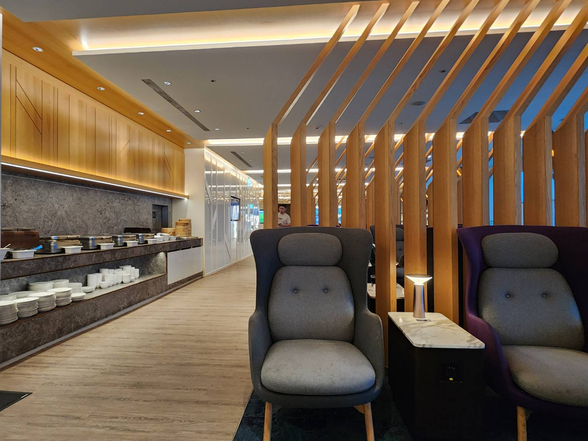
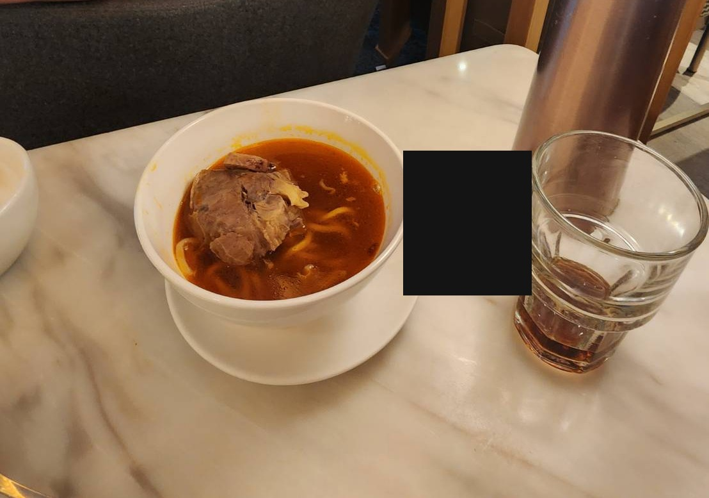
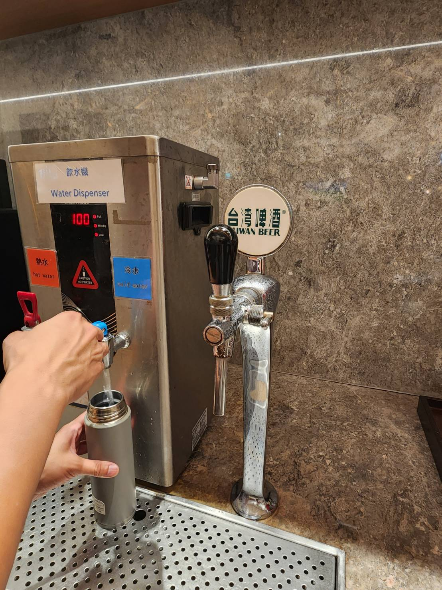
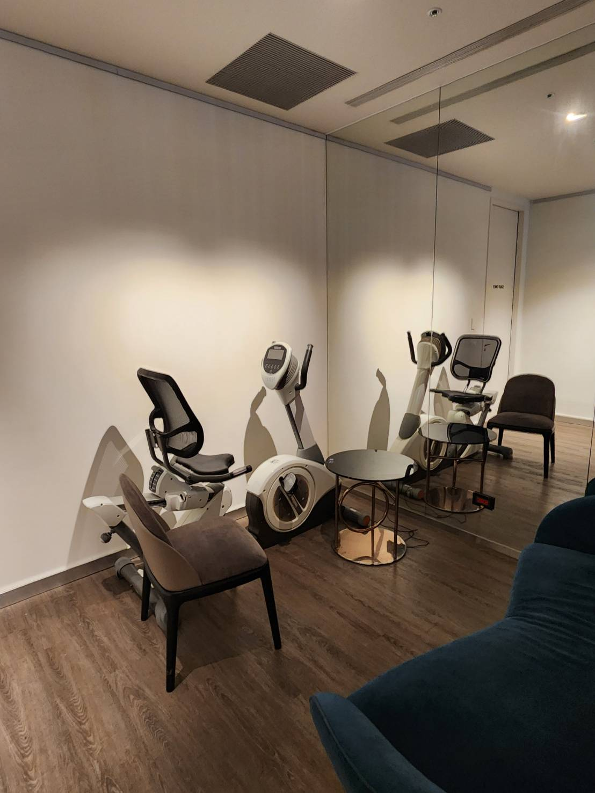
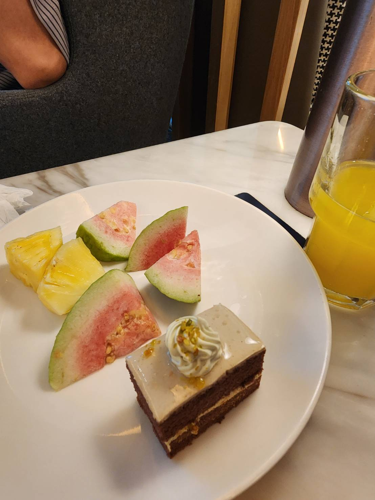
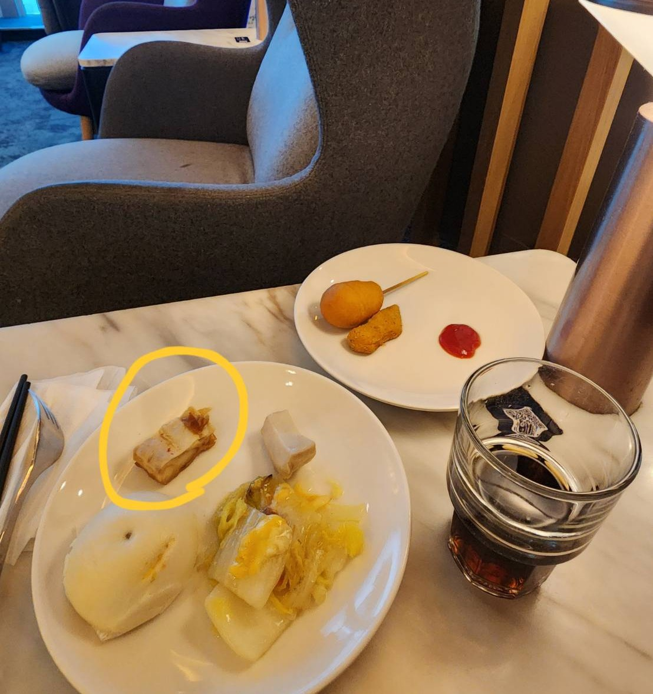

# 美國卡的副卡也能免費進貴賓室？HSBC Elite 實測TPE桃園國際機場二航廈（含 2 人免費、不用註冊）

出發那天，我姐在長榮櫃檯傳訊息來：

> 姐：櫃哥問我要飛去哪裡……我想了老半天……我的腦子是裝水嗎？一直想不起來到底我今天要去哪裡？？？差點把亞洲的地名想一遍……我真的追劇追到腦子壞。
>
> 我：拷腰，過太爽了。

（其實只是櫃檯印登機證、寄行李時的例行問題。）

一個連自己要飛去哪都想不起來的人，等一下要用**她自己的副卡**，自己走進貴賓室。這就是這篇要實測的事。

---

## 這次驗證了什麼

我幫我姐辦了一張 HSBC Elite 的副卡（authorized user，**年費 $0**）。她這次自己去機場，實測結果：

- **副卡本人出示自己名字的實體卡＋登機證，口頭說「Priority Pass」，直接進場**
- **不需要事先上網註冊**，也沒有什麼獨立會員卡號
- **正副卡卡號相同，完全不影響**
- **含 2 位同行免費**（本人＋2 共 3 人），第 4 位起每人 US$35
- 停留上限 **3 小時**

_現場服務單特寫（服務單號與 WiFi 資訊已遮）。_

不是聽櫃檯說說而已——**服務單白紙黑字印著：「PRIORITY PASS｜成人(PP-Adult)/3HR｜數量 2」**。免費、可帶 2 人、3 小時，全部印在單子上。

---

## 查資料時要小心的一個雷：別套錯市場規則

辦副卡前先提醒一個容易踩的雷：HSBC 美國的副卡跟主卡是**同一組卡號**（美國卡常見做法）。網路上很容易查到「HSBC World Elite 要上網註冊 Priority Pass」的教學，但這些多半在講 **UK 版**的 HSBC Premier World Elite——那個市場確實是每張卡各自登記、用 App 數位會員卡。**US 版的機制完全不同**，不需要這一套。

查美卡權益，第一步永遠是認明**這是哪一國發的卡**。同一個卡名，不同市場的規則可以差很遠。

---

## 官方到底怎麼說

Priority Pass 官方的 HSBC World Elite 頁面寫得很清楚，進場方式**兩種擇一**：

> Simply present your HSBC World Elite Mastercard at the lounge and mention Priority Pass to enter.

也就是：**出示實體卡＋說一句 Priority Pass**，就這樣。官方明講事先啟用「不是必要」，想用 App 數位會員卡的人才需要去註冊。

這就是同卡號副卡能用的關鍵——走「出示卡」這條路，根本不經過註冊系統。櫃檯辨識的是：有效的 HSBC Elite 卡＋卡上的名字＋登機證。副卡是我姐自己名字的實體卡，成立。

---

## 實測現場：桃園二航 Oriental Club Lounge（東方宇逸）

位置在第二航廈 4 樓出境大廳。以下照片全部出自我姐之手——先招認：

> 我：多分享一點……我要當素材。

所以這篇的「實測」，是一個第一次用貴賓室的人，最誠實的視角。

_入口招牌。（路人臉已打碼）_

_木隔屏、高背椅、自助餐檯——平日時段人不多。_

### 🍜 招牌牛筋牛肉麵

現點現做的牛肉麵，牛筋給得大方，湯是紅燒底。飛機餐前先來一碗熱的，體感直接拉滿。

_飛機餐前先來一碗熱的，體感直接拉滿。_

### 🍺 自助台灣啤酒生啤機

這是她自己發現的：

> 姐：貴賓室有台啤，我裝開水的時候發現的。……其實旁邊還有泡麵，我沒拍。
>
> 我：拷腰，還有這種喔，也是在貴賓室裡面？？

生啤機就裝在飲水機旁邊——裝開水裝到一半，抬頭看到「台灣啤酒」的拉霸。這種不期而遇，比任何福利清單都有說服力。

_台啤生啤機，就裝在飲水機旁邊。_

### 🏋️ 竟然有健身器材

貴賓室裡有一間附鏡牆的小房間，擺著臥式健身車。登機前騎個十分鐘活動筋骨——我沒在其他貴賓室文看過有人寫這個。

_登機前騎個十分鐘活動筋骨——別的貴賓室文很少提到這個。_

### 🍰 甜點、水果，還有鯊魚煙

甜點檯有蛋糕和現切水果。然後是我姐的私心推薦：

> 姐：你知道這是什麼嗎？它是鯊魚煙，蠻好吃的。

（她還先傳錯照片，補了一張用黃圈圈起來的才對。）貴賓室出現台式黑白切，這個在地化程度我給過。

_甜點檯的蛋糕和現切水果。_

_黃圈圈起來的就是鯊魚煙——貴賓室出現台式黑白切。_

---

## 重點不是省這一次錢

一次貴賓室的市價幾百塊台幣，說實話，省這個不是重點。

重點是這個結構：**一張主卡 → 一張 $0 年費的副卡 → 家人從此擁有自己的貴賓室權益**。

不是「我帶她進去」，是**她自己就進得去**，還能再帶 2 個人。她飛她的，我飛我的，權益各自獨立。這才是美卡系統的玩法——主卡的福利不是一個人用，是想辦法**複製**給全家。

這也呼應我一直講的：**先打地基，順序比選擇重要**。先有 Premier 關係、辦下 Elite 主卡，副卡和它背後的這些權益，都是地基打好之後自然長出來的東西。

---

附註：這是 2026 年 7 月、桃園二航東方宇逸的單次實測 DP。Priority Pass 的合作據點與規則、HSBC 的權益內容都可能變動，出發前以 Priority Pass 官方頁面和你卡片當期的 Guide to Benefits 為準。

---

## 這張卡值不值得為了這個辦？

貴賓室是 HSBC Elite 的亮點之一，但年費 $495 值不值，要整張卡一起算——$400 旅遊 credit 怎麼吃、Retention Offer 怎麼談，我在[HSBC Elite 完整評測](/posts/hsbc-us-elite-card-review)裡算給你看。申請路線（台灣人、免 SSN）則在[《沒有ITIN/SSN、沒有美國地址，我怎麼申到美國信用卡》](/posts/hsbc-us-elite-application-from-taiwan)。

至於「我的機場有哪些 Priority Pass 貴賓室、哪間值得去」——我正在做一個中文查詢工具，之後找機會另外公開，先賣個關子。

下一篇想把「副卡策略」整個展開：哪些美卡的副卡值得辦、$0 副卡到底能複製哪些權益給家人。家裡有人在等你辦副卡的，歡迎留言。
