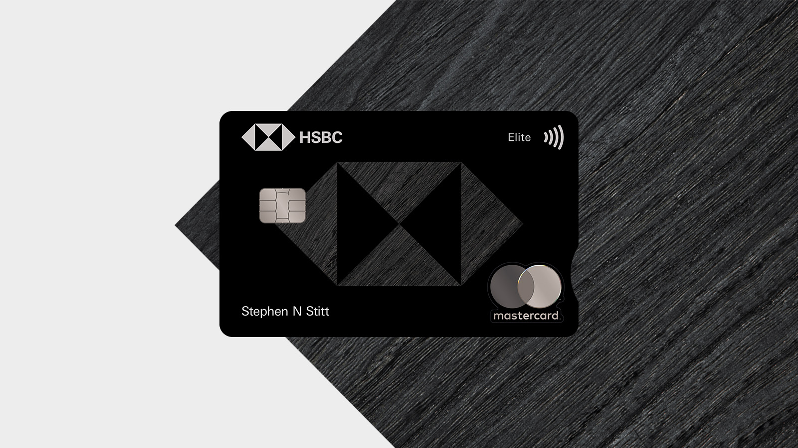
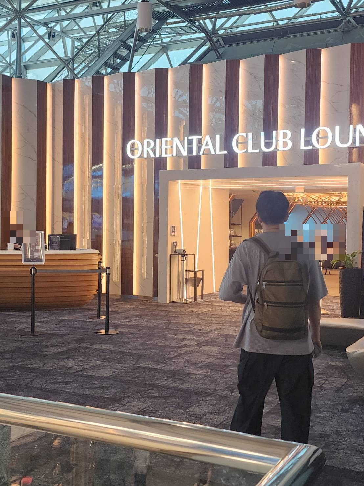
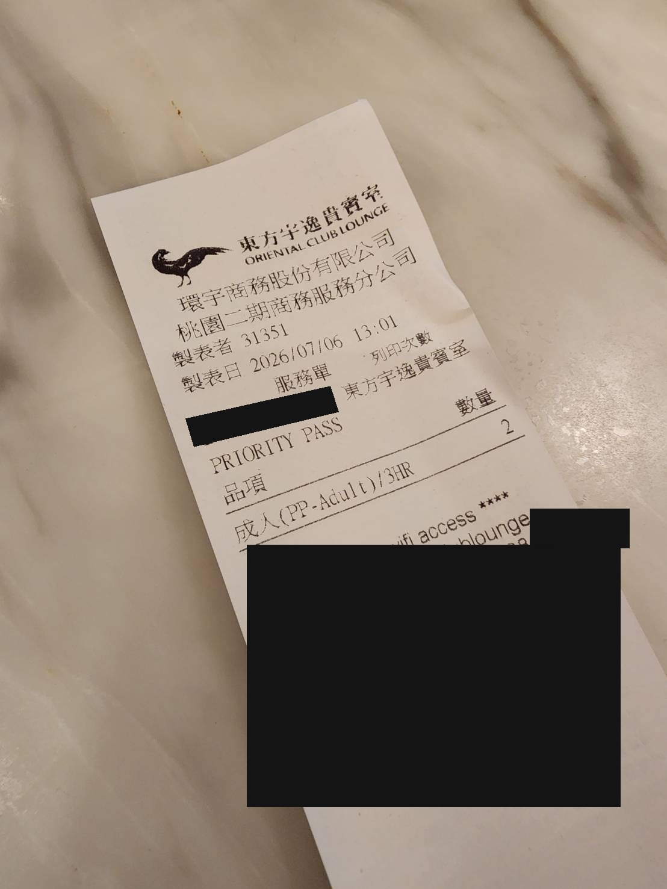

HSBC Elite World Mastercard 年費 $495，乍看不便宜，但它不是只靠單一福利撐場面。

這張卡有三個我最重視的優勢：機票／飯店／租車 5x 點數、每年最高 $400 的 HSBC Travel Credit，以及真正讓我覺得有差異化的 **Priority Pass** 權益。

其中 Priority Pass 是這張卡最有意思的地方：主卡可以用，Authorized User 免費副卡也有使用資格；每位 eligible cardholder 每次還能帶最多 2 位同伴。對常帶家人出國的人來說，這就不只是「一張高年費卡」，而是一套家庭旅行的機場通行方案。

這篇拆給你看：Priority Pass 主卡＋副卡的價值怎麼算、$400 credit 值不值得換，順便提一下年費出帳後別急著繳、值得先問問客服有沒有 retention offer。

上一篇寫過[怎麼從台灣、不用 SSN 申請到這張卡](/posts/hsbc-us-elite-application-from-taiwan)，這篇把卡片本身拆開來算。

_圖片來源：HSBC US 官方網站。_

---

## 卡片基本資料

| 項目 | 內容 |
|------|------|
| 年費 | $495（附卡 $0）|
| 點數計畫 | HSBC US Rewards |
| 機票／飯店／租車 | 5x 點數 |
| 餐廳＋其他旅遊類別（Other Travel）| 2x 點數 |
| 點數出路 | 可轉航空哩程（我主要盯長榮，轉點比例以當下官網公告為準）|
| 申請門檻 | 實質上需要 HSBC Premier 關係（路線見上一篇）|

> ⚠️ **加成類別 2026-07-13 剛改版**（我拿到的官方 Guide 生效日就是這天，這篇發文時是新制剛上路第二天）：以前「旅遊相關」幾乎全部算 5x，新制把 5x 收窄到只剩機票、飯店、租車三類，其餘旅遊子類——**旅行社訂票、叫車服務（Uber/Lyft）、遊輪、火車、渡輪、露營車**等——全部降到跟餐廳同一級的 2x。如果你平常靠旅行社訂票或常叫車，這是實質降級，刷卡前留意一下商戶分類。

（開卡禮與費率會隨檔期變動，申請前以你實際看到的申請頁與條款為準。）

---

## 主要福利（含台灣可用性）

我照「在台灣吃不吃得到」幫每一項標註，這是多數美卡評測不會替我們做的事。

**1）Priority Pass：主卡＋免費副卡都能用，這才是真正核心**

官方條款明列：不論主卡還是 Authorized User（免費副卡），都算 eligible cardholder，都能用 Priority Pass；每位 eligible cardholder 還能各帶最多 2 位同伴進場（每次最多 3 人）。部分機場沒有貴賓室、或貴賓室客滿時，Priority Pass 網絡在部分據點也提供合作餐廳的用餐額度（一般行情約每人 $28 美金上下，但這是 Priority Pass 網絡通用資料，不是 HSBC 這份條款白紙黑字保證的數字，實際有沒有、額度多少，依機場與餐廳而定，出發前務必用 Priority Pass App 查當下顯示的結果）。

實務上怎麼進場：官方 Guide 寫得很直接，eligible cardholder 或 authorized user 出示**實體 HSBC Elite 卡＋登機證**、跟櫃檯說一句「Priority Pass」就能進，這是主要入口，不需要先註冊 PP App 數位會員卡。Priority Pass App 的數位會員卡是另一個選項，但不是唯一路徑——官方註明**同一組帳號只有 1 人能註冊數位會員卡**，所以對副卡家人來說，最穩的做法就是出國時務必帶實體卡＋登機證，現場直接走實體卡這條路。

這不是一張卡送你自己一個人進貴賓室而已。加了免費副卡（副卡年費 $0）之後，這張卡就不只是主卡本人可以進貴賓室：副卡家人自己出國時，也能用自己那張 HSBC Elite 卡走 Priority Pass 權益，各帶最多 2 位同伴，不需要跟主卡本人同行。

_桃園機場二航東方宇逸貴賓室入口——副卡家人這次就是從這裡出示實體卡進場的。_

_貴賓室裡的招牌牛筋牛肉麵——Priority Pass 的價值不是抽象數字，吃過就知道。_

（這條不是紙上談兵：幫家人辦了副卡，7/6 在桃園機場二航 Oriental Club Lounge 實測成功，服務單直接印出 PP-Adult/3HR/數量 2。完整實測過程另外寫一篇，之後貼出來。）

_現場服務單：PRIORITY PASS、成人(PP-Adult)/3HR、數量 2——證實副卡免費、含 2 人、停留上限 3 小時。（服務單號與 WiFi 資訊已遮）_

**2）旅遊 credit：每年最高 $400，但不是訂多少退多少**

官方條款寫得很明確：透過 **HSBC Travel（Priceline 承辦）**累積消費每滿 **$2,000**，自動退 **$100** 帳單回饋，一年最多 $400——換算下來，**要在這個平台上花滿 $8,000，才拿得到全額 $400**。用點數兌換、或直接跟航空公司/飯店訂（不經 HSBC Travel）都不算數。

這代表這 $400 能不能拿滿，取決於你願不願意把一整年的機票飯店開銷都改道走 HSBC Travel。如果你本來就有這個消費量、平台價差也不大，這筆是純回血；如果你的旅遊開銷分散在各家官網/OTA，湊不到 $8,000，這項福利就要打折看待。

**3）機票／飯店／租車 5x 點數（2026-07-13 新制，範圍變窄了）**

細節見上面「卡片基本資料」的說明框——舊制幾乎所有旅遊子類都算 5x，新制收窄到只剩機票、飯店、租車，其餘（含旅行社訂票、叫車）降到 2x。

**4）Global Entry / TSA PreCheck / NEXUS credit：最高 $120（每 4.5 年）**

純台灣身分基本用不到（報銷價值 ≈ 0），有美國身分的家人可以吃。

**5）Rideshare credit：每月 $10（每年最高 $120）**

根據網路上其他持卡人 DP，Uber、滴滴打車消費都能成功報銷這筆 credit。

（這個 credit 跟前面提到的點數加成是兩件事：叫車消費在新制下賺 2x 點數，這裡的 $10/月是另外疊加的帳單回饋，兩者互不影響、可以同時吃到。）

**6）Instacart+：每年最高 $140**

美國限定，台灣用不到（報銷價值 ≈ 0）。

一句話總結：檯面福利加起來聲稱破千，但**住台灣真正穩穩吃得到的是 Priority Pass（含免費副卡）**，$400 旅遊 credit 要看你願不願意把一整年旅遊開銷都改道走 HSBC Travel 平台湊到 $8,000，其他項目當贈品，別算進回本公式。

---

## 年費實算（台灣視角，只算吃得到的）

誠實版算法（假設你在 HSBC Travel 上湊滿 $8,000 消費、拿到全額 $400）：

- 年費 **−$495**
- HSBC Travel 訂機票/飯店累積滿額 **+$400**
- 淨成本 **$95** —— 換 Priority Pass 主卡＋免費副卡一整年（各自帶 2 位同伴）

問題換個問法會更貼近這張卡的價值：**你願不願意用 $95，換全家一整年的機場貴賓室通行方案？** 只要一年出國一次以上、常帶家人同行，這個問題的答案通常是願意。

但反過來說也要老實：**如果這一年沒出國、湊不到 $8,000 走 HSBC Travel、或不願意綁這個平台，這張卡實際成本會更接近 $495 甚至更高**。它不是無腦留的卡，是「有出國量、願意配合平台」才回本的卡。

---

## 年費出帳後，別急著繳

年費出帳那幾天，我沒有直接繳掉，先開 chat 跟客服表明「年費剛出帳，我在評估這張卡要不要留」，結果真的談到一組加點的 retention offer。

Retention offer 不是人人都有、金額也因人因時而異，我不打算把確切數字和話術寫死在網路上公開——太精確的資訊被廣傳，容易讓銀行往後收緊這類 offer，反而害了後面想談的人。想知道的可以留言或私訊我聊細節。

只講一個通用心法：**年費出帳後、繳費前**是問的最佳時機，這時銀行最有動機留你；語氣就陳述你在評估要不要續卡，不用威脅剪卡。

---

## 這張卡適合誰

- ✅ 已有 HSBC Premier 資格（這是這張卡實質的入場券）
- ✅ 每年有機票/飯店開銷，能接受透過 HSBC Travel 預訂
- ✅ 常帶家人出國，會考慮辦免費副卡讓家人自己也能用 Priority Pass

- ❌ 沒有 Premier 資格（先看上一篇的路線，門檻在前面）
- ❌ 一年出國不到一次
- ❌ 不想研究 credit 的使用規則，只想要無腦現金回饋

如果你也卡在「沒有 SSN/ITIN、沒有美國地址、沒有美國電話，不知道從哪裡下手」——這條路是我目前找到的路線中，少數不需要這些美國身分文件就走得通的：關鍵只在於你在台灣有沒有 HSBC Premier 資格。完整申請過程、補件問答、時間線，我寫在[上一篇](https://credit-card-blog.vercel.app/posts/hsbc-us-elite-application-from-taiwan)。

這張卡的定位講清楚就是：**$400 credit 拿來抵年費，Priority Pass 主卡＋免費副卡才是真正留下它的理由**。只看回饋率、或只盯著那 $400 好不好湊，你不會覺得這張卡多神；但把「全家人都能各自用機場貴賓室」算進去，它就變成一張很難找到替代品的家庭旅行卡。

如果你也在評估 HSBC Premier／HSBC US Elite 這條路線，或想知道從台灣怎麼開 HSBC US、怎麼申請這張卡，可以留言或私訊我。

---

先說清楚：福利內容、金額與規則以 HSBC 當期官網和 Guide to Benefits 為準，銀行隨時可能改版；Retention Offer 更是因人、因時而異，不保證人人有、也不保證金額相同。

---

下一篇就是文中提到的副卡貴賓室實測全紀錄：家人的副卡在桃園機場二航怎麼進 Oriental Club Lounge、現場怎麼刷卡、服務單長什麼樣、有沒有卡關，一次寫完。想先睹為快的可以留言敲碗。

手上有 HSBC Elite 在猶豫要不要辦副卡、要不要續卡、或年費剛出帳想去談 retention 的，也歡迎留言聊聊。
